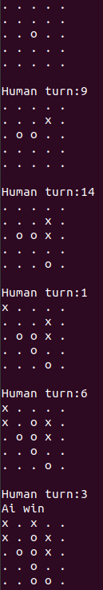

# TTT5
Gameplay
-----


Rule
------
Game win condition: get 4 in a line in a 5 x 5 grid

Package Requirements
------
Tensorflow (CPU version):```pip3 install tensorflow```

To play
------
run play.py: ```python3 play.py```\
Enter in location to play\
Location table:

|  |  |  |  |   |
|---|---|---|---|---|
|1|2|3|4|5|
|6|7|8|9|10|
|11|12|13|14|15|
|16|17|18|19|20|
|21|22|23|24|25|

Edit ```first``` in play.py to change first player\
Edit ```name``` in play.py to change AI model

Purpose
------
Create an AI using Deep Q-learning to master this game.

Training reward system
------
Moves that are invalid and loses the game are given -1 as reward. Moves that win the game are given 1 as reward. All other moves are given 0 as reward.

Result
------
After training about 1,500,000 states of the game, it is able to play better than an average human, but it did not mastered the game.
